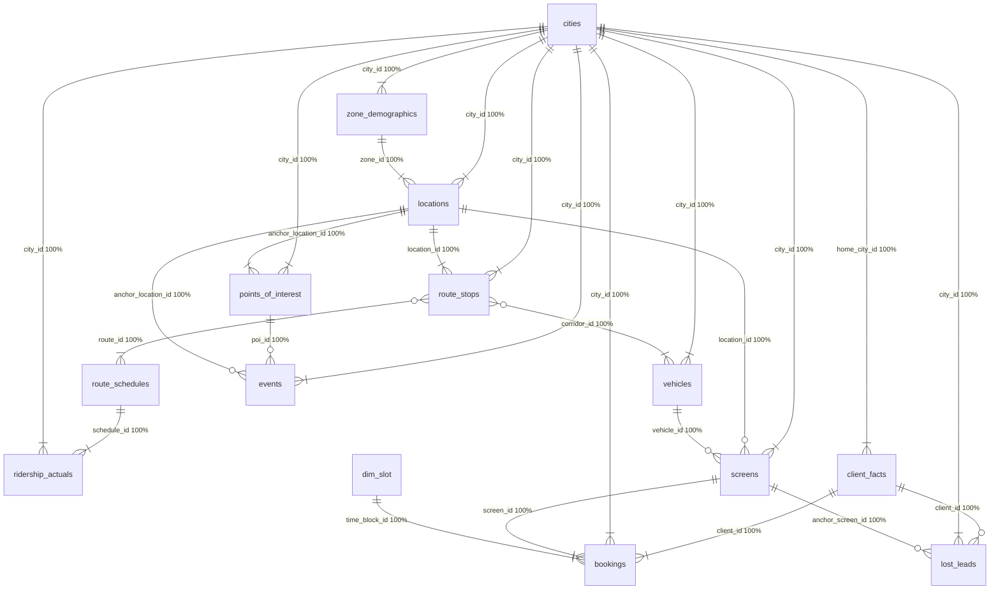

# Data Dictionary — Urban Media Datasets

> **Generated file — do not edit by hand.** Regenerate with `python scripts/build_data_dictionary.py`.
> Every figure below is measured from the raw CSVs (2026-08-21 16:29 UTC).

**Tables:** 14 · **Total rows:** 2,279,693 · **Columns awaiting a stated meaning:** 0

## Contents

- **Geography** — [`cities`](#cities), [`zone_demographics`](#zone_demographics), [`locations`](#locations)
- **Network** — [`route_stops`](#route_stops), [`route_schedules`](#route_schedules), [`ridership_actuals`](#ridership_actuals), [`vehicles`](#vehicles)
- **Inventory** — [`screens`](#screens), [`dim_slot`](#dim_slot)
- **Context** — [`points_of_interest`](#points_of_interest), [`events`](#events)
- **Commercial** — [`client_facts`](#client_facts), [`bookings`](#bookings), [`lost_leads`](#lost_leads)

## Table summary

| Table | Layer | Rows | Cols | Primary key | PK unique | Dupe rows | Grain |
| --- | --- | --- | --- | --- | --- | --- | --- |
| [`cities`](#cities) | geography | 3 | 6 | city_id | yes | 0 | One row per city in the network. |
| [`zone_demographics`](#zone_demographics) | geography | 30 | 15 | zone_id | yes | 0 | One row per city zone. |
| [`locations`](#locations) | geography | 910 | 6 | location_id | yes | 0 | One row per physical location (stop / station / roadside point). |
| [`route_stops`](#route_stops) | network | 2,436 | 11 | route_id + stop_sequence | yes | 0 | One row per (route, stop_sequence) — a route's ordered stop list. |
| [`route_schedules`](#route_schedules) | network | 19,838 | 7 | schedule_id | yes | 0 | One row per scheduled trip (route x day_type x departure time). |
| [`ridership_actuals`](#ridership_actuals) | network | 2,049,632 | 7 | schedule_id + date | yes | 0 | One row per (scheduled trip, date) with realised ridership. |
| [`vehicles`](#vehicles) | network | 854 | 5 | vehicle_id | yes | 0 | One row per vehicle carrying screens. |
| [`screens`](#screens) | inventory | 11,163 | 7 | screen_id | yes | 0 | One row per physical screen — the unit that is sold. |
| [`dim_slot`](#dim_slot) | inventory | 6 | 5 | time_block_id | yes | 0 | One row per sellable time block of the day. |
| [`points_of_interest`](#points_of_interest) | context | 1,375 | 13 | poi_id | yes | 0 | One row per POI, already anchored to its nearest location. |
| [`events`](#events) | context | 367 | 14 | event_id | yes | 0 | One row per event occurrence with its impact window. |
| [`client_facts`](#client_facts) | commercial | 520 | 15 | client_id | yes | 0 | One row per client account. |
| [`bookings`](#bookings) | commercial | 191,109 | 21 | booking_id | yes | 0 | One row per booking line item: a screen x time block held for a date range. Occupancy needs the booking-expansion transform (Step 1.5). |
| [`lost_leads`](#lost_leads) | commercial | 1,450 | 24 | lead_id | yes | 0 | One row per lost lead / failed negotiation. |

## Tables

### `cities`

*Layer:* **geography** · *Rows:* **3** · *Columns:* **6** · *Memory:* 0.0 MB

**Grain.** One row per city in the network.

**Role.** Top of the geography hierarchy; market tier is a candidate price driver.

**Primary key.** `city_id` — verified unique; nulls in key: 0; exact duplicate rows: 0

| Column | Dtype | Null % | Distinct | Min / Max | Mean | Top values | Meaning |
| --- | --- | --- | --- | --- | --- | --- | --- |
| `city_id` | object | 0.0% | 3 | — | — | LH (1); ACS (1); DAT (1) | Short city code (LH / ACS / DAT). Prefix of every other id in the city. |
| `city_name` | object | 0.0% | 3 | — | — | Las Hackland (1); Accordionshire (1); DA Town (1) | Display name of the city. Never a join key — use city_id. |
| `population` | int64 | 0.0% | 3 | 850000 / 3200000 | 1.833e+06 | — | Total city population. Scale reference only; audience maths uses zone figures. |
| `transit_density` | category | 0.0% | 3 | — | — | dense (1); mixed (1); sprawling (1) | dense / mixed / sprawling. Shapes how much of the audience is transit-borne. |
| `market_tier` | category | 0.0% | 3 | — | — | premium (1); standard (1); value (1) | premium / standard / value. One city per tier, so this is the city-level price-tier lever and the base of the pricing ladder's top rung. |
| `timezone` | category | 0.0% | 3 | — | — | America/Chicago (1); America/Denver (1); America/New_York (1) | IANA zone, one per city. All daypart and slot reasoning must be in local time. |

### `zone_demographics`

*Layer:* **geography** · *Rows:* **30** · *Columns:* **15** · *Memory:* 0.0 MB

**Grain.** One row per city zone.

**Role.** Resident base and daytime multiplier per zone — the D1 demographic backbone.

**Primary key.** `zone_id` — verified unique; nulls in key: 0; exact duplicate rows: 0

| Column | Dtype | Null % | Distinct | Min / Max | Mean | Top values | Meaning |
| --- | --- | --- | --- | --- | --- | --- | --- |
| `zone_id` | object | 0.0% | 30 | — | — | LH-ZONE-001 (1); LH-ZONE-002 (1); LH-ZONE-003 (1); LH-ZONE-004 (1); LH-ZONE-005 (1); LH-ZONE-006 (1) | Zone key, '<CITY>-ZONE-nnn'. 10 zones per city, 30 in total. |
| `city_id` | object | 0.0% | 3 | — | — | LH (10); ACS (10); DAT (10) | Owning city. |
| `zone_name` | object | 0.0% | 30 | — | — | Downtown Core (1); Harborfront (1); Old Mill District (1); Uptown Crescent (1); Financial Row (1); Cathedral Heights (1) | Display name, unique across the network. Matches locations.city_zone. |
| `resident_population` | int64 | 0.0% | 30 | 39792 / 422555 | 1.833e+05 | — | Residents living in the zone — the night-time base, not the audience. |
| `population_density_per_sqkm` | int64 | 0.0% | 30 | 1277 / 14946 | 6,333 | — | Residents per km2. Proxy for how compressed footfall is. |
| `median_age` | float64 | 0.0% | 26 | 23.9 / 48.7 | 38.95 | — | Median resident age. Coarse audience-fit signal; the pct_* bands are sharper. |
| `pct_age_under_18` | float64 | 0.0% | 28 | 5.3 / 29.9 | 17 | — | Share of residents under 18. Rarely an ad target; useful as a dilution signal. |
| `pct_age_18_34` | float64 | 0.0% | 26 | 10 / 65.8 | 28.78 | — | Share aged 18-34. Maps to the young-adult target bands the briefs request. |
| `pct_age_35_54` | float64 | 0.0% | 25 | 17.2 / 38.9 | 32.77 | — | Share aged 35-54. Maps to the professional/upgrader target bands. |
| `pct_age_55_plus` | float64 | 0.0% | 27 | 5.9 / 34.5 | 21.45 | — | Share aged 55+. Completes the age mix (the four bands sum to ~100). |
| `median_household_income` | int64 | 0.0% | 30 | 40425 / 151810 | 7.948e+04 | — | Absolute income in local currency. income_index is the comparable form. |
| `income_index` | float64 | 0.0% | 30 | 73.5 / 171.7 | 108 | — | Affluence indexed to the network (100 = average). Feeds premium-audience affinity. |
| `pct_bachelor_or_higher` | float64 | 0.0% | 29 | 18.2 / 73.2 | 40.66 | — | Education share; correlates with white-collar and premium segments. |
| `dominant_occupation` | category | 0.0% | 5 | — | — | mixed (14); white_collar (7); blue_collar (3); retail_service (3); student (3) | mixed / white_collar / blue_collar / retail_service / student. The single strongest categorical discriminator between zones for audience labelling. |
| `daytime_population_multiplier` | float64 | 0.0% | 28 | 0.58 / 3.39 | 1.388 | — | Daytime population / residents. The bridge from residents to actual audience — a 3.4x business district behaves nothing like a 1.0x suburb. Key D1 input. |

### `locations`

*Layer:* **geography** · *Rows:* **910** · *Columns:* **6** · *Memory:* 0.3 MB

**Grain.** One row per physical location (stop / station / roadside point).

**Role.** Anchor of the static-geography path screen -> location -> zone -> city.

**Primary key.** `location_id` — verified unique; nulls in key: 0; exact duplicate rows: 0

| Column | Dtype | Null % | Distinct | Min / Max | Mean | Top values | Meaning |
| --- | --- | --- | --- | --- | --- | --- | --- |
| `location_id` | object | 0.0% | 910 | — | — | LH-LOC-0120 (1); LH-LOC-0135 (1); LH-LOC-0311 (1); LH-LOC-0078 (1); LH-LOC-0210 (1); LH-LOC-0050 (1) | Location key, '<CITY>-LOC-nnnn'. 910 locations across the three cities. |
| `city_id` | object | 0.0% | 3 | — | — | LH (350); DAT (300); ACS (260) | Owning city. |
| `name` | object | 0.0% | 430 | — | — | Cedar Blvd & Prospect St (7); Montrose Ave & Foundry Ln (6); Concourse Ave & Beacon St (6); Cathedral Heights Terminal (6); Grant Rd & Montrose Ave (6); Kingsley Rd & Delancy Ave (5) | Street-intersection or station name. Display only — never match on it. |
| `city_zone` | object | 0.0% | 30 | — | — | Financial Row (36); Old Mill District (36); Harborfront (36); Downtown Core (36); Uptown Crescent (36); East Commons (34) | Denormalised zone name; zone_id is the join key. Both are always populated. |
| `zone_id` | object | 0.0% | 30 | — | — | LH-ZONE-005 (36); LH-ZONE-003 (36); LH-ZONE-002 (36); LH-ZONE-001 (36); LH-ZONE-004 (36); LH-ZONE-010 (34) | Zone the location sits in — the hop that gives a static screen its demographics. |
| `location_type` | category | 0.0% | 2 | — | — | bus_stop (719); metro_station (191) | bus_stop (719) or metro_station (191). Determines dwell time: a platform holds a waiting audience for minutes, a bus stop for far less. |

### `route_stops`

*Layer:* **network** · *Rows:* **2,436** · *Columns:* **11** · *Memory:* 0.7 MB

**Grain.** One row per (route, stop_sequence) — a route's ordered stop list.

**Role.** Path a vehicle-mounted screen traverses; source of corridor identity.

**Primary key.** `route_id + stop_sequence` — verified unique; nulls in key: 0; exact duplicate rows: 0

| Column | Dtype | Null % | Distinct | Min / Max | Mean | Top values | Meaning |
| --- | --- | --- | --- | --- | --- | --- | --- |
| `route_id` | object | 0.0% | 188 | — | — | LH-RT-M003-IN (21); LH-RT-M003-OUT (21); LH-RT-M013-IN (21); LH-RT-M013-OUT (21); LH-RT-M009-IN (19); LH-RT-M009-OUT (19) | Directional route key, '<CITY>-RT-<code>-<IN|OUT>'. |
| `corridor_id` | object | 0.0% | 94 | — | — | LH-RT-M003 (42); LH-RT-M013 (42); LH-RT-M009 (38); LH-RT-M002 (38); DAT-RT-M006 (38); ACS-RT-B009 (36) | Directionless route family (the route_id without the direction suffix). Vehicles attach to a corridor, not to a route — this is the mobile-audience unit. |
| `city_id` | object | 0.0% | 3 | — | — | LH (998); DAT (794); ACS (644) | Owning city. |
| `route_name` | object | 0.0% | 36 | — | — | Route B14 (98); Route B16 (94); Route B9 (92); Route B21 (90); Route B18 (86); Silver Line (86) | Display name of the route (e.g. 'Route B1'). |
| `mode` | category | 0.0% | 2 | — | — | bus (1,660); metro (776) | bus (1,660 stop rows) or metro (776). Sets which vehicle_type serves the route. |
| `direction` | category | 0.0% | 2 | — | — | inbound (1,218); outbound (1,218) | inbound / outbound, perfectly balanced. The two directions of one corridor share an audience, so de-duplicate across them in the overlap graph. |
| `stop_sequence` | int64 | 0.0% | 21 | 1 / 21 | 7.359 | — | 1-based position of the stop along the route; second half of the primary key. |
| `location_id` | object | 0.0% | 910 | — | — | LH-LOC-0018 (6); LH-LOC-0266 (6); LH-LOC-0116 (6); LH-LOC-0336 (6); LH-LOC-0196 (6); DAT-LOC-0043 (6) | The physical location served — the join that ties a route to POIs and zones. |
| `is_first_stop` | boolean | 0.0% | 2 | 0 / 1 | — | False (2,248); True (188) | True at stop_sequence 1. Terminus flag, useful for dwell assumptions. |
| `is_last_stop` | boolean | 0.0% | 2 | 0 / 1 | — | False (2,248); True (188) | True at the final stop. |
| `num_stops` | int64 | 0.0% | 13 | 8 / 21 | 13.72 | — | Denormalised stop count for the route (8-21). Sanity-check value only. |

### `route_schedules`

*Layer:* **network** · *Rows:* **19,838** · *Columns:* **7** · *Memory:* 4.7 MB

**Grain.** One row per scheduled trip (route x day_type x departure time).

**Role.** Trip frequency by day type — the exposure multiplier for mobile screens.

**Primary key.** `schedule_id` — verified unique; nulls in key: 0; exact duplicate rows: 0

| Column | Dtype | Null % | Distinct | Min / Max | Mean | Top values | Meaning |
| --- | --- | --- | --- | --- | --- | --- | --- |
| `schedule_id` | object | 0.0% | 19,838 | — | — | LH-SCH-000001 (1); LH-SCH-000002 (1); LH-SCH-000003 (1); LH-SCH-000004 (1); LH-SCH-000005 (1); LH-SCH-000006 (1) | Trip key, '<CITY>-SCH-nnnnnn'. One row per scheduled departure. |
| `route_id` | object | 0.0% | 188 | — | — | LH-RT-M006-OUT (244); LH-RT-M010-OUT (243); ACS-RT-M004-OUT (243); LH-RT-M003-OUT (241); DAT-RT-M006-OUT (241); ACS-RT-M002-OUT (240) | Directional route the trip runs on. |
| `corridor_id` | object | 0.0% | 94 | — | — | LH-RT-M006 (479); LH-RT-M010 (477); ACS-RT-M004 (477); LH-RT-M001 (475); LH-RT-M003 (475); DAT-RT-M006 (474) | Denormalised corridor of that route. |
| `direction` | category | 0.0% | 2 | — | — | inbound (9,943); outbound (9,895) | inbound / outbound; redundant with the route_id suffix. |
| `day_type` | category | 0.0% | 2 | — | — | weekday (13,052); weekend (6,786) | weekday (13,052) or weekend (6,786). The only calendar dimension of the schedule — weekday/weekend service levels differ and briefs ask for weekend weighting. |
| `start_time` | object | 0.0% | 1,084 | — | — | 06:01 (44); 06:04 (41); 06:00 (39); 18:51 (39); 06:02 (37); 08:08 (36) | HH:MM departure in local city time. Bucket into dim_slot to get the time block. |
| `estimated_ridership` | int64 | 0.0% | 417 | 4 / 420 | 150.2 | — | Planned riders for the trip. Compare with ridership_actuals to measure how much the schedule under- or over-states real exposure. |

### `ridership_actuals`

*Layer:* **network** · *Rows:* **2,049,632** · *Columns:* **7** · *Memory:* 383.6 MB

**Grain.** One row per (scheduled trip, date) with realised ridership.

**Role.** Realised exposure volume; source of the normalised daypart curve (Step 1.6).

**Primary key.** `schedule_id + date` — verified unique; nulls in key: 0; exact duplicate rows: 0

| Column | Dtype | Null % | Distinct | Min / Max | Mean | Top values | Meaning |
| --- | --- | --- | --- | --- | --- | --- | --- |
| `schedule_id` | object | 0.0% | 19,838 | — | — | DAT-SCH-006849 (130); DAT-SCH-006848 (130); DAT-SCH-006847 (130); DAT-SCH-006846 (130); DAT-SCH-006845 (130); LH-SCH-000032 (130) | The scheduled trip this observation belongs to. |
| `route_id` | object | 0.0% | 188 | — | — | LH-RT-M006-OUT (25,948); LH-RT-M010-OUT (25,818); ACS-RT-M004-OUT (25,740); LH-RT-M003-OUT (25,714); DAT-RT-M006-OUT (25,714); ACS-RT-M002-OUT (25,506) | Denormalised route of that trip. |
| `city_id` | object | 0.0% | 3 | — | — | LH (845,754); DAT (715,078); ACS (488,800) | Owning city. |
| `date` | datetime64[ns] | 0.0% | 182 | 2026-02-19 / 2026-08-19 | — | — | Calendar date of the observation. Spans 2026-02-19 to 2026-08-19 — six months, which is narrower than the bookings span, so exposure must be seasonally extrapolated. |
| `day_of_week` | category | 0.0% | 7 | — | — | Friday (339,352); Monday (339,352); Thursday (339,352); Wednesday (339,352); Tuesday (339,352); Saturday (176,436) | Weekday name. Weekday trips appear on all five weekdays; weekend trips only Sat/Sun — so day_type in route_schedules and this column must agree. |
| `is_holiday` | boolean | 0.0% | 2 | 0 / 1 | — | False (2,029,794); True (19,838) | True on holidays (~1% of rows). Holiday days behave like weekends; keep them out of the weekday baseline curve. |
| `actual_ridership` | int64 | 0.0% | 709 | 2 / 734 | 179.6 | — | Realised riders on the trip (2-734, median 129). The exposure numerator for every mobile screen and for transit throughput at a stop. |

### `vehicles`

*Layer:* **network** · *Rows:* **854** · *Columns:* **5** · *Memory:* 0.1 MB

**Grain.** One row per vehicle carrying screens.

**Role.** Links a mobile screen to the corridor whose audience it is exposed to.

**Primary key.** `vehicle_id` — verified unique; nulls in key: 0; exact duplicate rows: 0

| Column | Dtype | Null % | Distinct | Min / Max | Mean | Top values | Meaning |
| --- | --- | --- | --- | --- | --- | --- | --- |
| `vehicle_id` | object | 0.0% | 854 | — | — | LH-VEH-00001 (1); LH-VEH-00002 (1); LH-VEH-00003 (1); LH-VEH-00004 (1); LH-VEH-00005 (1); LH-VEH-00006 (1) | Vehicle key, '<CITY>-VEH-nnnnn'. |
| `city_id` | object | 0.0% | 3 | — | — | LH (370); DAT (284); ACS (200) | Owning city. |
| `vehicle_type` | category | 0.0% | 2 | — | — | metro_train (449); bus (405) | metro_train (449) or bus (405). Decides whether a screen's audience is captive riders in a coach or street-facing passers-by. |
| `corridor_id` | object | 0.0% | 94 | — | — | LH-RT-M003 (25); LH-RT-M013 (25); DAT-RT-M006 (23); LH-RT-M010 (22); LH-RT-M005 (20); ACS-RT-M004 (19) | The corridor the vehicle is assigned to — the mobile screen's exposure path. |
| `screen_count` | int64 | 0.0% | 3 | 2 / 4 | 3.062 | — | Screens fitted to the vehicle (2-4). Cross-check against the screens table. |

### `screens`

*Layer:* **inventory** · *Rows:* **11,163** · *Columns:* **7** · *Memory:* 2.2 MB

**Grain.** One row per physical screen — the unit that is sold.

**Role.** The inventory spine. location_id XOR vehicle_id decides static vs mobile, which decides which D1 exposure model applies.

**Primary key.** `screen_id` — verified unique; nulls in key: 0; exact duplicate rows: 0

| Column | Dtype | Null % | Distinct | Min / Max | Mean | Top values | Meaning |
| --- | --- | --- | --- | --- | --- | --- | --- |
| `screen_id` | object | 0.0% | 11,163 | — | — | LH-SCR-000001 (1); LH-SCR-000002 (1); LH-SCR-000003 (1); LH-SCR-000004 (1); LH-SCR-000005 (1); LH-SCR-000006 (1) | Screen key, '<CITY>-SCR-nnnnnn'. The sellable asset; 11,163 in total. |
| `city_id` | object | 0.0% | 3 | — | — | LH (6,304); DAT (3,123); ACS (1,736) | Owning city. |
| `screen_type` | category | 0.0% | 4 | — | — | metro_station (6,391); bus_stop (2,157); metro_rail_coach (1,400); bus (1,215) | metro_station (6,391) / bus_stop (2,157) / metro_rail_coach (1,400) / bus (1,215). The first two are static, the last two vehicle-mounted — a measured 1:1 match with the location_id / vehicle_id split, so screen_type alone identifies the D1 model. |
| `location_id` | object | 23.4% | 910 | — | — | LH-LOC-0073 (50); LH-LOC-0078 (50); LH-LOC-0097 (50); LH-LOC-0003 (50); LH-LOC-0047 (50); LH-LOC-0083 (50) | Set for the 8,548 static screens (76.6%), null for mobile ones. |
| `vehicle_id` | object | 76.6% | 854 | — | — | DAT-VEH-00139 (4); DAT-VEH-00140 (4); DAT-VEH-00141 (4); DAT-VEH-00142 (4); DAT-VEH-00143 (4); DAT-VEH-00144 (4) | Set for the 2,615 mobile screens (23.4%), null for static ones. Exactly one of location_id / vehicle_id is populated on every row — verified, not assumed. |
| `position` | category | 12.5% | 6 | — | — | platform (5,116); entrance_exit (1,275); right (1,124); left (1,124); top (719); back (405) | platform / entrance_exit / left / right / top / back. Null on all 1,400 metro_rail_coach screens (interior coach panels have no mount face). Drives visibility and the interior-captive vs exterior-passer-by audience distinction. |
| `screen_size` | category | 0.0% | 3 | — | — | M (4,528); L (3,428); S (3,207) | S / M / L, roughly evenly split. Candidate price driver — test in Step 1.5. |

### `dim_slot`

*Layer:* **inventory** · *Rows:* **6** · *Columns:* **5** · *Memory:* 0.0 MB

**Grain.** One row per sellable time block of the day.

**Role.** The time dimension of a sellable unit (screen x time block x slot x date).

**Primary key.** `time_block_id` — verified unique; nulls in key: 0; exact duplicate rows: 0

| Column | Dtype | Null % | Distinct | Min / Max | Mean | Top values | Meaning |
| --- | --- | --- | --- | --- | --- | --- | --- |
| `time_block_id` | int64 | 0.0% | 6 | 1 / 6 | 3.5 | — | 1-6. Six four-hour blocks cover the full day with no gaps or overlaps. |
| `time_block_label` | category | 0.0% | 6 | — | — | 00:00-04:00 (1); 04:00-08:00 (1); 08:00-12:00 (1); 12:00-16:00 (1); 16:00-20:00 (1); 20:00-24:00 (1) | 'HH:MM-HH:MM' display form of the block. |
| `start_hour` | int64 | 0.0% | 6 | 0 / 20 | 10 | — | Inclusive start hour, local time (0, 4, 8, 12, 16, 20). |
| `end_hour` | int64 | 0.0% | 6 | 4 / 24 | 14 | — | Exclusive end hour (4, 8, 12, 16, 20, 24). |
| `nearest_daypart` | category | 0.0% | 5 | — | — | night (2); afternoon (1); evening (1); midday (1); morning (1) | night / morning / midday / afternoon / evening. Note night maps to two blocks (1 and 6), so daypart is NOT a key — always aggregate by time_block_id. |

### `points_of_interest`

*Layer:* **context** · *Rows:* **1,375** · *Columns:* **13** · *Memory:* 0.4 MB

**Grain.** One row per POI, already anchored to its nearest location.

**Role.** Footfall pull and environment character around a location (D1 POI signal).

**Primary key.** `poi_id` — verified unique; nulls in key: 0; exact duplicate rows: 0

| Column | Dtype | Null % | Distinct | Min / Max | Mean | Top values | Meaning |
| --- | --- | --- | --- | --- | --- | --- | --- |
| `poi_id` | object | 0.0% | 1,375 | — | — | LH-POI-0001 (1); LH-POI-0002 (1); LH-POI-0003 (1); LH-POI-0004 (1); LH-POI-0005 (1); LH-POI-0006 (1) | POI key, '<CITY>-POI-nnnn'. |
| `city_id` | object | 0.0% | 3 | — | — | LH (591); DAT (447); ACS (337) | Owning city. |
| `city_zone` | object | 0.0% | 30 | — | — | Downtown Core (81); Central Yard (69); Old Mill District (61); Harborfront (61); Uptown Crescent (59); Financial Row (58) | Zone name the POI sits in; may differ from the anchor location's zone. |
| `name` | object | 0.0% | 1,088 | — | — | Metro Fresh Market (4); Landmark Market (4); Metro Corporate Center (4); Founders Square Mall (4); Cedar Business Park (4); Central Yard Business Park (4) | Display name of the POI. |
| `poi_type` | category | 0.0% | 13 | — | — | shopping_mall (225); grocery_anchor (202); office_park (175); residential_tower (154); entertainment_district (141); government_building (112) | 13 values — shopping_mall, grocery_anchor, office_park, residential_tower, entertainment_district, government_building, hospital, corporate_campus, university, hotel_convention, museum, tourist_landmark, stadium_arena. This is the vocabulary the briefs' environment language (mall entry, campus edge, nightlife) must resolve onto. |
| `scale` | category | 0.0% | 4 | — | — | neighborhood (507); minor (401); major (358); flagship (109) | neighborhood / minor / major / flagship. Ordinal weight on the POI's pull; use alongside est_daily_footfall rather than instead of it. |
| `est_daily_footfall` | int64 | 0.0% | 1,227 | 57 / 51195 | 4,071 | — | Estimated daily visitors. The magnitude of the pull — cap any single POI's contribution so one flagship cannot dominate a screen's profile. |
| `anchor_location_id` | object | 0.0% | 910 | — | — | LH-LOC-0005 (6); ACS-LOC-0004 (5); LH-LOC-0042 (4); LH-LOC-0028 (4); DAT-LOC-0027 (4); LH-LOC-0023 (4) | Nearest network location. Proximity is pre-computed for us, so POI context is a join plus a distance filter, not a geospatial search. |
| `distance_to_location_km` | float64 | 0.0% | 571 | 0.012 / 1.154 | 0.2739 | — | Distance to that location in km. Distance-decay input; the radius cut-off that actually carries signal is validated in Step 1.6. |
| `distance_to_location_mi` | float64 | 0.0% | 411 | 0.007 / 0.717 | 0.1702 | — | The same distance in miles. Redundant — use the km column. |
| `is_network_hub` | boolean | 0.0% | 2 | 0 / 1 | — | False (748); True (627) | True where the POI is itself a transit interchange-scale hub (~46%). |
| `side_of_road` | category | 0.0% | 2 | — | — | near_side (728); far_side (647) | near_side / far_side. A far-side POI is weaker visibility evidence: the audience is across the road from the screen. |
| `peak_daypart` | category | 0.0% | 5 | — | — | evening (401); afternoon (307); morning (299); midday (245); night (123) | Daypart when the POI's footfall peaks — aligns POI pull with the time block being sold rather than smearing it across the day. |

### `events`

*Layer:* **context** · *Rows:* **367** · *Columns:* **14** · *Memory:* 0.1 MB

**Grain.** One row per event occurrence with its impact window.

**Role.** Temporal demand surges — raw material for the Phase 6 event-surge component.

**Primary key.** `event_id` — verified unique; nulls in key: 0; exact duplicate rows: 0

| Column | Dtype | Null % | Distinct | Min / Max | Mean | Top values | Meaning |
| --- | --- | --- | --- | --- | --- | --- | --- |
| `event_id` | object | 0.0% | 367 | — | — | ACS-EVT-00062 (1); ACS-EVT-00051 (1); ACS-EVT-00074 (1); ACS-EVT-00055 (1); ACS-EVT-00037 (1); ACS-EVT-00001 (1) | Event key, '<CITY>-EVT-nnnnn'. |
| `city_id` | object | 0.0% | 3 | — | — | LH (157); DAT (119); ACS (91) | Owning city. |
| `city_zone` | object | 0.0% | 30 | — | — | Financial Row (50); Fallowfield (46); Central Yard (46); Downtown Core (26); Harrow Point (16); Harborfront (16) | Zone the event takes place in. |
| `poi_id` | object | 23.4% | 147 | — | — | ACS-POI-0337 (40); LH-POI-0590 (35); DAT-POI-0447 (34); DAT-POI-0397 (3); DAT-POI-0048 (3); DAT-POI-0117 (3) | Host POI where one applies; null for 23% of events (street events, parades). |
| `anchor_location_id` | object | 0.0% | 208 | — | — | ACS-LOC-0004 (40); DAT-LOC-0241 (35); LH-LOC-0005 (35); DAT-LOC-0051 (4); LH-LOC-0025 (4); DAT-LOC-0267 (3) | Nearest network location — the geographic anchor for the surge. |
| `event_name` | object | 0.0% | 114 | — | — | Encore Concert Series (17); Live Wire Concert Series (16); Neon Nights Concert Series (14); Summer Sound Concert Series (14); Farmers Fair (10); Community Rally (10) | Display name of the event. |
| `event_type` | category | 0.0% | 10 | — | — | sports_game (82); concert (70); festival (41); community_fair (33); parade (29); convention (29) | 10 values: sports_game, concert, festival, community_fair, parade, convention, trade_show, holiday_event, political_rally, marathon_race. Type predicts the audience the surge brings, not just its size. |
| `recurrence` | category | 0.0% | 3 | — | — | one_time (264); weekly_season (82); annual (21) | one_time (264) / weekly_season (82) / annual (21). weekly_season rows must be expanded across their season before they can be matched to a campaign window. |
| `start_date` | datetime64[ns] | 0.0% | 274 | 2025-08-19 / 2027-02-19 | — | — | First day of the event. Span 2025-08 to 2027-02, covering the booking window. |
| `end_date` | datetime64[ns] | 0.0% | 265 | 2025-08-19 / 2027-02-19 | — | — | Last day; equals start_date for single-day events. |
| `expected_attendance` | int64 | 0.0% | 366 | 731 / 44966 | 1.662e+04 | — | Headcount estimate — the magnitude of the demand surge. |
| `attendance_tier` | category | 0.0% | 3 | — | — | large (175); medium (175); small (17) | small / medium / large. Banded form of expected_attendance; use the tier for the surge multiplier so a single outlier cannot distort pricing. |
| `primary_impact_daypart` | category | 0.0% | 5 | — | — | evening (129); afternoon (87); midday (65); morning (53); night (33) | Daypart the surge lands in — restricts the uplift to the time blocks actually affected instead of the whole day. |
| `impact_radius_km` | float64 | 0.0% | 190 | 0.31 / 2.96 | 1.783 | — | Radius over which the surge is felt. Combined with POI/location distances, this is what joins an event to the screens it should uplift. |

### `client_facts`

*Layer:* **commercial** · *Rows:* **520** · *Columns:* **15** · *Memory:* 0.2 MB

**Grain.** One row per client account.

**Role.** Client context for the relationship adjustment in pricing (Step 6.3).

**Primary key.** `client_id` — verified unique; nulls in key: 0; exact duplicate rows: 0

| Column | Dtype | Null % | Distinct | Min / Max | Mean | Top values | Meaning |
| --- | --- | --- | --- | --- | --- | --- | --- |
| `client_id` | object | 0.0% | 520 | — | — | CLI-00001 (1); CLI-00002 (1); CLI-00003 (1); CLI-00004 (1); CLI-00005 (1); CLI-00006 (1) | Client key, 'CLI-nnnnn'. 520 accounts. |
| `company_name` | object | 0.0% | 520 | — | — | Cinema Entertainment (1); Care Clinics (1); Ledger Bank (1); Drive Dealerships (1); Link Networks (1); Neon Live Events (1) | Display name of the client. |
| `industry` | category | 0.0% | 13 | — | — | retail (76); entertainment (59); finance (52); cpg (50); auto (46); technology (38) | Client's vertical, drawn from the same 13-value set as bookings.industry_vertical. |
| `client_tier` | category | 0.0% | 3 | — | — | local_business (294); regional_chain (149); national_chain (77) | local_business (294) / regional_chain (149) / national_chain (77). Size of the account; a pricing and leverage input, not an audience one. |
| `home_city_id` | object | 0.0% | 3 | — | — | ACS (179); LH (176); DAT (165) | City the account is based in; may differ from where it buys. |
| `active_cities` | object | 0.0% | 12 | — | — | LH (127); ACS (124); DAT (111); ACS|LH|DAT (24); LH|ACS (22); DAT|LH|ACS (21) | Pipe-delimited city codes ('ACS|LH|DAT'). Must be split before joining — and the order varies, so treat it as a set, never as a string to match. |
| `preferred_geographies` | object | 0.0% | 243 | — | — | LH:Riverside Junction (15); ACS:Old Orchard (15); ACS:Brookview (15); DAT:Lakeside Loop (14); DAT:Northbank (14); LH:Harborfront (13) | Pipe-delimited '<CITY>:<Zone name>' pairs (243 distinct values). Parse into (city_id, zone_name) tuples; the zone name joins to zone_demographics.zone_name. |
| `typical_campaign_budget` | float64 | 0.0% | 345 | 2,200 / 6.27e+05 | 6.201e+04 | — | The account's usual spend. Prior for a brief with no stated budget. |
| `budget_variance_pct` | float64 | 0.0% | 48 | 0.08 / 0.55 | 0.3168 | — | How much that budget typically moves — the width of the prior. |
| `campaign_frequency` | category | 0.0% | 4 | — | — | one_off (178); seasonal (165); quarterly (129); always_on (48) | one_off / seasonal / quarterly / always_on. How often the account buys; an always_on client is worth more over the year than one deal suggests. |
| `avg_campaign_duration_days` | int64 | 0.0% | 86 | 7 / 118 | 30.65 | — | Typical flight length for the account. |
| `bundle_affinity` | category | 0.0% | 3 | — | — | single_screen (277); moderate_bundle (160); heavy_bundle (83) | single_screen (277) / moderate_bundle (160) / heavy_bundle (83). Prior on whether this client will accept a multi-screen package. |
| `negotiation_leverage` | category | 0.0% | 3 | — | — | low (262); medium (180); high (78) | low (262) / medium (180) / high (78). Direct input to the win-probability model and the client-relationship price adjustment (Steps 6.3-6.4). |
| `relationship_start_date` | datetime64[ns] | 0.0% | 476 | 2018-04-30 / 2026-08-19 | — | — | First date of the relationship; tenure is a discount justification. |
| `account_status` | category | 0.0% | 2 | — | — | active (465); lapsed (55) | active (465) or lapsed (55). Lapsed accounts should not set current demand. |

### `bookings`

*Layer:* **commercial** · *Rows:* **191,109** · *Columns:* **21** · *Memory:* 68.6 MB

**Grain.** One row per booking line item: a screen x time block held for a date range. Occupancy needs the booking-expansion transform (Step 1.5).

**Role.** Realised commercial history and committed future occupancy. Only settled rows are training data; future-dated rows are occupancy, a different input.

**Primary key.** `booking_id` — verified unique; nulls in key: 0; exact duplicate rows: 0

| Column | Dtype | Null % | Distinct | Min / Max | Mean | Top values | Meaning |
| --- | --- | --- | --- | --- | --- | --- | --- |
| `booking_id` | object | 0.0% | 191,109 | — | — | DAT-BKG-0000001 (1); DAT-BKG-0000002 (1); DAT-BKG-0000003 (1); DAT-BKG-0000004 (1); DAT-BKG-0000005 (1); DAT-BKG-0000006 (1) | Line-item key, '<CITY>-BKG-nnnnnnn'. 191,109 lines. |
| `deal_id` | object | 0.0% | 56,762 | — | — | DEAL-000728 (1,045); DEAL-000496 (1,030); DEAL-000971 (1,021); DEAL-000160 (992); DEAL-000897 (968); DEAL-000278 (938) | Groups line items into one negotiated deal — the 'bundle is one deal' key. 56,762 deals; the 55,485 non-bundle lines are one deal each, while 135,624 bundled lines belong to only 1,277 deals (~106 lines per bundle). Bundles dominate value and must be priced jointly, never line by line. |
| `client_id` | object | 0.0% | 520 | — | — | CLI-00271 (4,603); CLI-00416 (4,106); CLI-00455 (3,961); CLI-00085 (3,861); CLI-00224 (3,718); CLI-00399 (3,683) | Buying account. |
| `city_id` | object | 0.0% | 3 | — | — | LH (119,967); DAT (53,969); ACS (17,173) | City of the booked screen. |
| `screen_id` | object | 0.0% | 9,939 | — | — | ACS-SCR-001209 (73); ACS-SCR-001210 (66); ACS-SCR-001221 (64); ACS-SCR-001225 (63); ACS-SCR-001214 (62); ACS-SCR-001206 (62) | The booked screen. 9,939 of 11,163 screens (89%) appear at least once. |
| `ad_type` | category | 0.0% | 208 | — | — | App Download Drive (Awareness) (4,303); Flavor Launch Promo (Reach) (4,182); Weekend Flash Sale (Conversion) (3,453); Wealth Management Campaign (Awareness) (3,399); Seasonal Sale Promotion (Conversion) (3,389); Enterprise Awareness Push (Awareness) (3,112) | Free-text creative/campaign name with the objective in parentheses. High cardinality — use campaign_objective and industry_vertical for modelling, not this. |
| `industry_vertical` | category | 0.0% | 13 | — | — | retail (27,914); finance (22,402); technology (18,899); cpg (18,537); entertainment (17,068); auto (16,864) | 13 values (auto, cpg, education, entertainment, finance, government, healthcare, hospitality, nonprofit, real_estate, retail, technology, telecom). Segment-heat demand signal and the target of the brief-vertical taxonomy mapping. |
| `campaign_objective` | category | 0.0% | 4 | — | — | awareness (75,534); reach (46,104); conversion (36,482); frequency (32,989) | awareness / conversion / frequency / reach. Only four values, and the briefs state objectives in prose — so taxonomy.yaml must map onto exactly these. |
| `time_block_id` | int64 | 0.0% | 6 | 1 / 6 | 3.363 | — | The four-hour block bought; joins to dim_slot. |
| `daypart` | category | 0.0% | 5 | — | — | morning (59,475); evening (47,142); midday (41,340); afternoon (26,082); night (17,070) | Denormalised dim_slot.nearest_daypart for that block. Redundant, and lossy for night (blocks 1 and 6 both map to it). |
| `slots_booked_per_day` | int64 | 0.0% | 6 | 1 / 6 | 2.653 | — | Rotation slots claimed per day, 1-6 (median 2). The quantity axis of the sellable unit and where price non-linearity must be tested. |
| `rotation_type` | category | 0.0% | 3 | — | — | partial_rotation (93,532); single_rotation (64,728); full_exclusivity (32,849) | partial_rotation (93,532) / single_rotation (64,728) / full_exclusivity (32,849). Categorical view of the same intensity as slots_booked_per_day — check they agree. |
| `start_date` | datetime64[ns] | 0.0% | 541 | 2025-08-19 / 2027-02-19 | — | — | First day of the flight. Span 2025-08-19 to 2027-02-21, so the table holds both settled history and future commitments. |
| `end_date` | datetime64[ns] | 0.0% | 545 | 2025-08-22 / 2027-02-21 | — | — | Last day of the flight, inclusive. |
| `duration_days` | int64 | 0.0% | 179 | 2 / 180 | 72.96 | — | Flight length, 2-180 days (median 63). Should equal end-start+1. |
| `booked_date` | datetime64[ns] | 0.0% | 603 | 2025-06-20 / 2027-02-18 | — | — | When the deal was signed. The only column safe for time-ordered validation: splitting on start_date leaks future information into training. |
| `contracted_price_per_slot_per_day` | float64 | 0.0% | 18,162 | 9.89 / 221 | 80.26 | — | The price target variable, already normalised per slot per day — model this, not line_item_value. |
| `line_item_value` | float64 | 0.0% | 158,086 | 47.37 / 1.628e+05 | 1.281e+04 | — | Realised value of this line (~price x slots x days). |
| `deal_total_value` | float64 | 0.0% | 53,474 | 101.5 / 3.221e+07 | 4.216e+06 | — | Value of the whole deal, repeated on every line. Summing it over lines multiplies bundle revenue ~106-fold — always de-duplicate by deal_id first. |
| `is_bundle` | boolean | 0.0% | 2 | 0 / 1 | — | True (135,624); False (55,485) | True on the 135,624 lines belonging to a multi-screen deal. |
| `booking_status` | category | 0.0% | 3 | — | — | completed (111,727); upcoming (49,428); active (29,954) | completed (111,727) / active (29,954) / upcoming (49,428). Only completed is training data; active and upcoming are committed occupancy, a different input entirely. |

### `lost_leads`

*Layer:* **commercial** · *Rows:* **1,450** · *Columns:* **24** · *Memory:* 0.7 MB

**Grain.** One row per lost lead / failed negotiation.

**Role.** The negative half of the demand signal: pipeline pressure (Step 6.1) and the price-gap curve that calibrates the price cap (Step 6.3).

**Primary key.** `lead_id` — verified unique; nulls in key: 0; exact duplicate rows: 0

| Column | Dtype | Null % | Distinct | Min / Max | Mean | Top values | Meaning |
| --- | --- | --- | --- | --- | --- | --- | --- |
| `lead_id` | object | 0.0% | 1,450 | — | — | LEAD-000001 (1); LEAD-000002 (1); LEAD-000003 (1); LEAD-000004 (1); LEAD-000005 (1); LEAD-000006 (1) | Lead key, 'LEAD-nnnnnn'. 1,450 lost leads. |
| `client_id` | object | 44.3% | 346 | — | — | CLI-00213 (10); CLI-00435 (10); CLI-00416 (8); CLI-00078 (7); CLI-00026 (7); CLI-00499 (7) | Existing account, where the lead came from one. Null on 643 rows — and those are exactly the rows where company_name_raw is populated, so every lead is identified by one column or the other. Null here means a new prospect, not missing data. |
| `company_name_raw` | object | 55.7% | 269 | — | — | Prime Boutique (9); Urban Mart (7); Torque Motors (7); Urban Outfitters (6); Trend Boutique (6); Cinema Media Group (6) | Free-text company name for prospects with no account yet (643 rows); null on the 807 rows that do have a client_id. |
| `industry_vertical` | category | 0.0% | 13 | — | — | retail (240); entertainment (132); cpg (127); healthcare (127); auto (125); finance (122) | Same 13-value vocabulary as bookings; drives segment-level pipeline heat. |
| `city_id` | object | 0.0% | 3 | — | — | ACS (508); LH (496); DAT (446) | City the lead asked for. |
| `requested_geography` | object | 0.0% | 30 | — | — | LH:Harborfront (86); ACS:Greenhollow (62); DAT:Northbank (60); ACS:Sunridge Acres (58); DAT:Lakeside Loop (55); DAT:Ashford Row (55) | '<CITY>:<Zone name>' string — parse to a zone before use. This is what makes a lead attributable to specific inventory and therefore to demand pressure. |
| `anchor_screen_id` | object | 0.0% | 1,279 | — | — | ACS-SCR-001702 (3); ACS-SCR-001586 (3); DAT-SCR-000330 (3); ACS-SCR-001720 (3); ACS-SCR-000053 (3); ACS-SCR-000616 (3) | The specific screen asked about, where the lead named one. |
| `lead_source` | category | 0.0% | 6 | — | — | repeat_client_inquiry (500); website_form (250); inbound_call (195); cold_outreach (189); referral (185); trade_show (131) | repeat_client_inquiry (500) / website_form / inbound_call / cold_outreach / referral / trade_show. Source correlates with intent quality. |
| `lead_date` | datetime64[ns] | 0.0% | 356 | 2025-08-19 / 2026-08-16 | — | — | When the lead arrived. The age input for the recency-decay weighting — a stale lead must count for less than a fresh one. |
| `sales_stage_reached` | category | 0.0% | 5 | — | — | initial_inquiry (531); quote_sent (415); negotiating (281); verbal_agreement (141); contract_sent (82) | initial_inquiry (531) / quote_sent (415) / negotiating (281) / verbal_agreement (141) / contract_sent (82). How far it got — a lead lost at contract_sent is far stronger evidence of real demand than one lost at initial_inquiry. |
| `lost_date` | datetime64[ns] | 0.0% | 354 | 2025-08-23 / 2026-08-19 | — | — | When the lead was marked lost. lost_date minus lead_date is the cycle length. |
| `requested_start_date` | datetime64[ns] | 0.0% | 388 | 2025-09-06 / 2026-10-18 | — | — | Flight start the client wanted — matches the lead to a demand window. |
| `requested_duration_days` | int64 | 0.0% | 125 | 7 / 173 | 39.12 | — | Flight length requested. |
| `requested_num_screens` | int64 | 0.0% | 29 | 1 / 33 | 6.914 | — | Screens requested, 1-33 (median 5). Sizes the lost opportunity. |
| `indicated_budget` | float64 | 0.0% | 1,449 | 1,000 / 8.356e+05 | 8.775e+04 | — | Budget the client stated. |
| `quoted_price_per_slot_per_day` | float64 | 36.6% | 889 | 8.88 / 260.2 | 71.91 | — | Our quote. Null for all 531 initial_inquiry leads and only those — the lead died before a price existed, so absence is meaningful, not missing. |
| `client_target_price_per_slot_per_day` | float64 | 47.6% | 731 | 6.99 / 198.2 | 62.79 | — | The price the client wanted; null wherever no quote was made or no counter-offer was given (47.6%). |
| `price_gap_pct` | float64 | 47.6% | 713 | -0.0476 / 0.4996 | 0.1803 | — | (quote - client target) / target. The core price-cap calibration signal: the gap at which deals demonstrably die is the willingness-to-pay ceiling. |
| `negotiation_rounds` | int64 | 0.0% | 6 | 0 / 5 | 0.8834 | — | Counter-offers exchanged, 0-5 (median 0). Effort spent before losing. |
| `competitor_mentioned` | boolean | 0.0% | 2 | 0 / 1 | — | False (1,193); True (257) | True where a competitor was named — a competitive-pressure flag. |
| `loss_reason` | category | 0.0% | 10 | — | — | price_too_high (305); no_response_ghosted (262); budget_mismatch (186); went_with_competitor (153); timing_conflict (125); contract_terms_disagreement (118) | 10 values. price_too_high (305) and budget_mismatch (186) are price losses and calibrate the cap; no_response_ghosted (262), went_with_competitor, timing_conflict, contract_terms_disagreement, inventory_unavailable, campaign_cancelled_internally, targeting_mismatch and creative_not_ready are not, and must be excluded from that fit. inventory_unavailable (107) is separately valuable: it is direct evidence of scarcity. |
| `loss_reason_detail` | object | 0.0% | 28 | — | — | Quoted rate exceeded client ceiling (111); Client benchmarked against a cheaper media mix (101); Rate card premium on hub screens broke the budget (93); Follow-up emails went unanswered (89); Inquiry appears to have been exploratory only (88); Client stopped responding after initial call (85) | Free-text elaboration of the reason; qualitative colour only. |
| `campaign_objective` | category | 0.0% | 4 | — | — | reach (375); awareness (372); frequency (372); conversion (331) | Same four-value vocabulary as bookings. |
| `ad_type` | category | 0.0% | 205 | — | — | Seasonal Sale Promotion (Frequency) (26); Loyalty Program Push (Reach) (21); New Store Opening (Conversion) (20); New Store Opening (Awareness) (19); Seasonal Sale Promotion (Reach) (19); Weekend Flash Sale (Frequency) (18) | Free-text creative name, as in bookings. |

## Join graph

Every edge below was **measured**, not assumed. `integrity` is the share of non-null child keys that resolve to a parent; `fan-out trap` marks edges where a naive merge multiplies rows and an explicit aggregation is required.

### Measured edges

| Child | Parent | Integrity | Null keys | Cardinality | Fan-out trap | Orphan rows | Status |
| --- | --- | --- | --- | --- | --- | --- | --- |
| `zone_demographics.city_id` | `cities.city_id` | 100.00% | 0.0% | N:1 | no | 0 | OK |
| `locations.city_id` | `cities.city_id` | 100.00% | 0.0% | N:1 | no | 0 | OK |
| `locations.zone_id` | `zone_demographics.zone_id` | 100.00% | 0.0% | N:1 | no | 0 | OK |
| `route_stops.city_id` | `cities.city_id` | 100.00% | 0.0% | N:1 | no | 0 | OK |
| `route_stops.location_id` | `locations.location_id` | 100.00% | 0.0% | N:1 | no | 0 | OK |
| `route_schedules.route_id` | `route_stops.route_id` | 100.00% | 0.0% | N:N | **yes** — aggregate before merging | 0 | OK |
| `ridership_actuals.schedule_id` | `route_schedules.schedule_id` | 100.00% | 0.0% | N:1 | no | 0 | OK |
| `ridership_actuals.city_id` | `cities.city_id` | 100.00% | 0.0% | N:1 | no | 0 | OK |
| `vehicles.city_id` | `cities.city_id` | 100.00% | 0.0% | N:1 | no | 0 | OK |
| `vehicles.corridor_id` | `route_stops.corridor_id` | 100.00% | 0.0% | N:N | **yes** — aggregate before merging | 0 | OK |
| `screens.city_id` | `cities.city_id` | 100.00% | 0.0% | N:1 | no | 0 | OK |
| `screens.location_id` | `locations.location_id` | 100.00% | 23.4% (declared nullable) | N:1 | no | 0 | OK |
| `screens.vehicle_id` | `vehicles.vehicle_id` | 100.00% | 76.6% (declared nullable) | N:1 | no | 0 | OK |
| `points_of_interest.city_id` | `cities.city_id` | 100.00% | 0.0% | N:1 | no | 0 | OK |
| `points_of_interest.anchor_location_id` | `locations.location_id` | 100.00% | 0.0% | N:1 | no | 0 | OK |
| `events.city_id` | `cities.city_id` | 100.00% | 0.0% | N:1 | no | 0 | OK |
| `events.poi_id` | `points_of_interest.poi_id` | 100.00% | 23.4% (declared nullable) | N:1 | no | 0 | OK |
| `events.anchor_location_id` | `locations.location_id` | 100.00% | 0.0% (declared nullable) | N:1 | no | 0 | OK |
| `client_facts.home_city_id` | `cities.city_id` | 100.00% | 0.0% | N:1 | no | 0 | OK |
| `bookings.client_id` | `client_facts.client_id` | 100.00% | 0.0% | N:1 | no | 0 | OK |
| `bookings.city_id` | `cities.city_id` | 100.00% | 0.0% | N:1 | no | 0 | OK |
| `bookings.screen_id` | `screens.screen_id` | 100.00% | 0.0% | N:1 | no | 0 | OK |
| `bookings.time_block_id` | `dim_slot.time_block_id` | 100.00% | 0.0% | N:1 | no | 0 | OK |
| `lost_leads.client_id` | `client_facts.client_id` | 100.00% | 44.3% (declared nullable) | N:1 | no | 0 | OK |
| `lost_leads.city_id` | `cities.city_id` | 100.00% | 0.0% | N:1 | no | 0 | OK |
| `lost_leads.anchor_screen_id` | `screens.screen_id` | 100.00% | 0.0% (declared nullable) | N:1 | no | 0 | OK |

### Fan-out traps and their required aggregation

- `route_schedules.route_id -> route_stops.route_id` — up to 21 parent rows per child key. Parent key is non-unique (route_stops is per stop); expect high fan-out.
- `vehicles.corridor_id -> route_stops.corridor_id` — up to 42 parent rows per child key. Parent key is non-unique; a corridor spans many route_stops rows.

### Key-path resolution

| Path | Start rows | Resolved | % | Why it matters |
| --- | --- | --- | --- | --- |
| static geography: screen -> location -> zone -> city | 8,548 | 8,548 | 100.00% | D1 static exposure: resident base and daytime multiplier for a fixed screen. |
| mobile exposure: screen -> vehicle -> corridor | 2,615 | 2,615 | 100.00% | D1 mobile exposure: the journey a vehicle-mounted screen travels. |
| ridership: ridership_actuals -> schedule -> route | 2,049,632 | 2,049,632 | 100.00% | Daypart exposure curve per route/corridor. |
| POI context: location -> POI | 1,375 | 1,375 | 100.00% | D1 POI pull, distance decay and side-of-road visibility. |
| event context: event -> location/zone | 367 | 367 | 100.00% | Phase 6 event-surge component. |
| commercial history: booking -> screen | 191,109 | 191,109 | 100.00% | Pricing training data and committed occupancy per screen. |
| slot claim: booking -> dim_slot | 191,109 | 191,109 | 100.00% | How a booking claims inventory in time; defines the sellable unit. |
| client: booking -> client | 191,109 | 191,109 | 100.00% | Client-relationship adjustment in pricing. |
| pipeline: lead -> client | 1,450 | 807 | 55.66% | Pipeline pressure and win-probability calibration. |

### Diagram

## Open semantics

0 column(s) still carry `#TODO-semantics`. Each must be resolved before Phase 3 by adding a `column_notes` entry in `src/agentiq/data/catalog.py` and regenerating this file.

